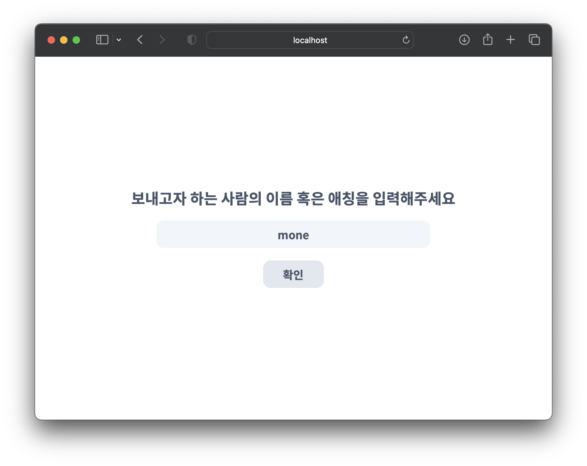
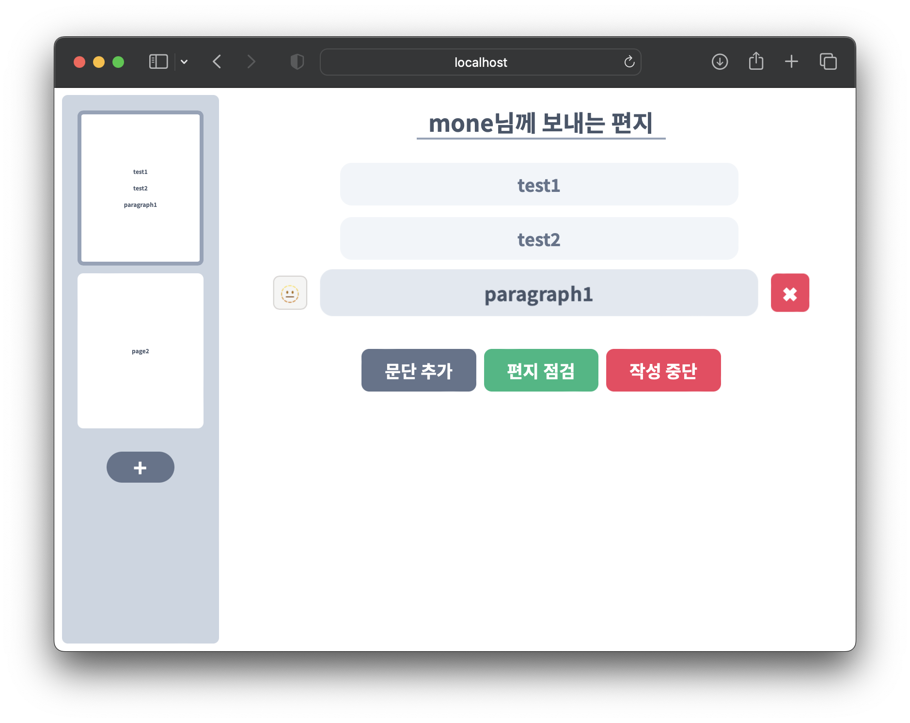
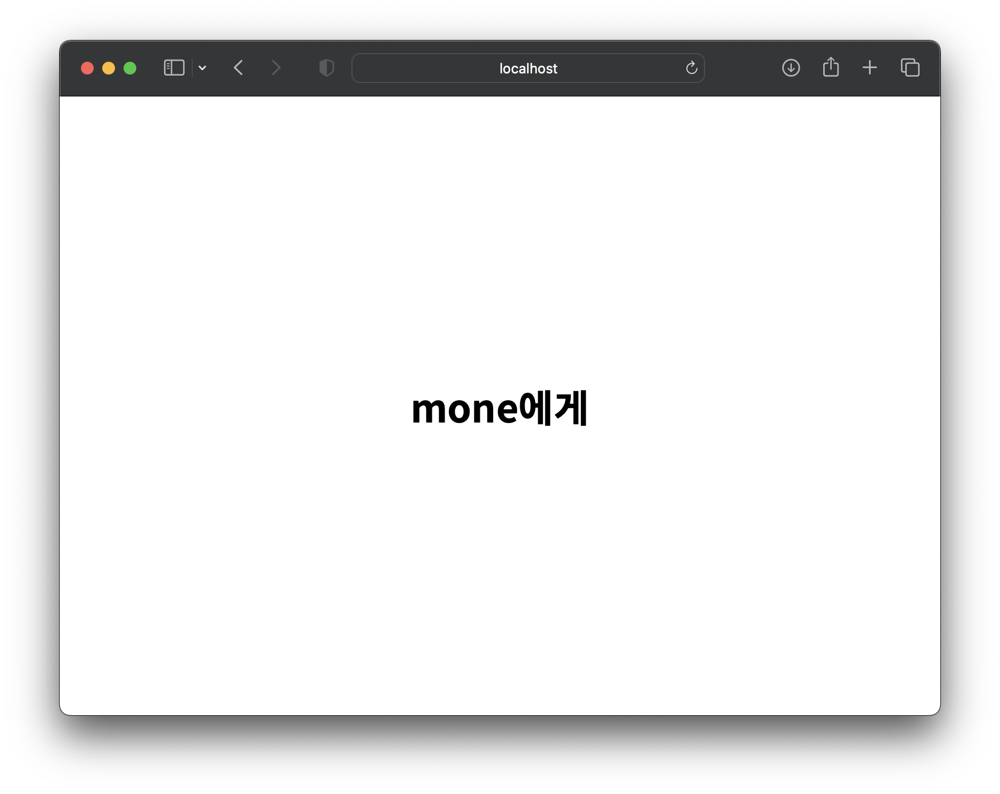
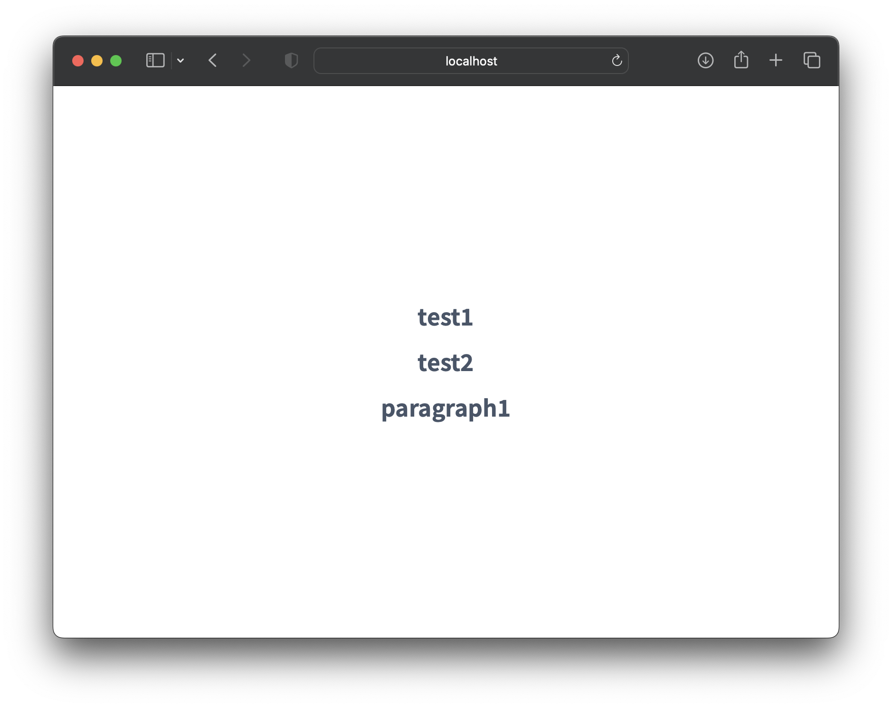

# 📝 The-Letters

### Why did you make it?
I liked to write notes, letters, blogs, everything. But among them, writing and reading letters seemed very boring. So I decided to change it and express it in my own way.

### Used Skills
* Front-end
  * [React.JS](https://reactjs.org)
  * [Framer Motion](https://www.framer.com/motion/)
  * [tailwindcss](https://tailwindcss.com)
  * [zustand](https://github.com/pmndrs/zustand)
  * [axios](https://axios-http.com)

* Back-end
  * [Nest.JS](https://nestjs.com)
  * [MongoDB](https://www.mongodb.com)

* Common
  * [TypeScript](https://www.typescriptlang.org)

* Tools
  * [Visual Studio Code](https://code.visualstudio.com)
  * [MongoDB Compass](https://code.visualstudio.com)

----

## Display Preview

### Write

### Read

